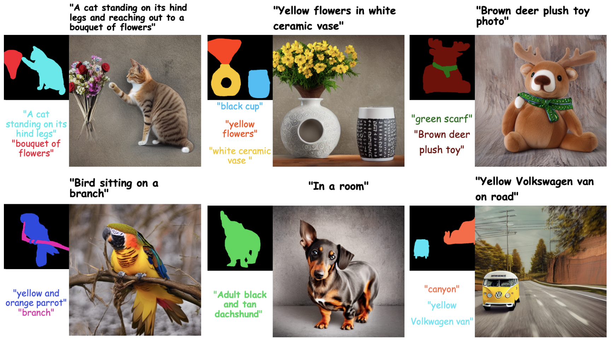
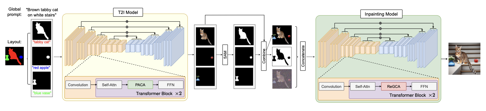

# Zero-Painter: Training-Free Layout Control for Text-to-Image Synthesis [CVPR 2024]

This repository is the official implementation of [Zero-Painter](https://arxiv.org/abs/2406.04032).


**[Zero-Painter: Training-Free Layout Control for Text-to-Image Synthesis](https://arxiv.org/abs/2406.04032)**
</br>
Marianna Ohanyan*,
Hayk Manukyan*,
Zhangyang Wang,
Shant Navasardyan,
[Humphrey Shi](https://www.humphreyshi.com)
</br>

[Arxiv](https://arxiv.org/abs/2406.04032) 

<p align="center">
  
<br>
<em>
We present <strong>Zero-Painter</strong> , a novel training-free framework for layout-conditional text-to-image synthesis that facilitates the creation of detailed and controlled imagery from textual prompts. Our method utilizes object masks and individual descriptions, coupled with a global text prompt, to generate images with high fidelity. Zero-Painter employs a two-stage process involving our novel <strong>Prompt-Adjusted Cross-Attention (PACA) and Region-Grouped Cross-Attention (ReGCA)</strong> blocks, ensuring precise alignment of generated objects with textual prompts and mask shapes. Our extensive experiments demonstrate that Zero-Painter surpasses current state-of-the-art methods in preserving textual details and adhering to mask shapes.

</em>
</p>

## 🔥 News
- [2024.06.6] ZeroPainter paper and code is released.
- [2024.02.27] Paper is accepted to CVPR 2024.


## ⚒️ Installation

<!-- Install with `conda`: 
```bash
conda env create -f environment.yaml
conda activate zero-painter
``` -->
Install with `pip`:
```bash
pip3 install -r requirements.txt
```

## 💃 Inference: Generate images with Zero-Painter

1. Download [models](https://huggingface.co/PAIR/Zero-Painter) and put them in the `models` folder.
2. You can use the following script to perform inference on the given mask and prompts pair:
```
python zero_painter.py \
  --mask-path data/masks/1_rgb.png \
  --metadata data/metadata/1.json \
  --output-dir data/outputs/
```

`meatadata` sould be in the following format
```
[{
    "prompt": "Brown gift box beside red candle.",
    "color_context_dict": {
        "(244, 54, 32)": "Brown gift box",
        "(54, 245, 32)": "red candle"
    }
}]
```
<!-- ```
python hd_inpaint.py \
  --model-id ONE_OF[ds8_inp, sd2_inp, sd15_inp] \
  --method ONE_OF[baseline, painta, rasg, painta+rasg] \
  --image-path HR_IMAGE_PATH \
  --mask-path HR_IMAGE_MASK \
  --prompt PROMPT_TXT \
  --output-dir OUTPUT_DIRECTORY
``` -->

## Method



---  

## 🎓 Citation
If you use our work in your research, please cite our publication:
```
@article{Zeropainter,
title={Zero-Painter: Training-Free Layout Control for Text-to-Image Synthesis},
url={http://arxiv.org/abs/2406.04032},
publisher={arXiv},
author={Ohanyan, Marianna and Manukyan, Hayk and Wang, Zhangyang and Navasardyan, Shant and Shi, Humphrey},
year={2024}}

```